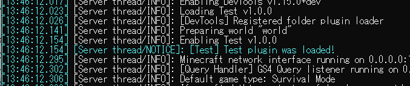

## プログラムの実行の仕方

実行の仕方というかこのメモでの実行という言葉の定義を説明します。
まずこのような構造になっていると思います。


まずは[DevTools](https://poggit.pmmp.io/p/DevTools/)というプラグインをダウンロードして、pluginsフォルダーに突っ込みましょう。

次にpluginsの下にこのようにフォルダとファイルを作ります。


エディタを起動し、

plugin.ymlに
```
name: Test
author: tomo
version: "1.0.0"
api: [3.0.0]
main: tomo\Main
```
と書きます。
このplugin.ymlはプラグインの名前やバージョン、Mainクラス、apiバージョン、そしてコマンドなどを保持しています。

./src/tomo/Main.phpに
```
<?php

declare(strict_types=1);

namespace tomo;

use pocketmine\plugin\PluginBase;
class Main extends PluginBase
{

    public function onEnable()
    {
        $this->getLogger()->notice("Test plugin was loaded!");
    }

    public function onDisable()
    {
        $this->getLogger()->notice("Test plugin was unloaded!");
    }
}
```

で保存します。

そしてpmmpを起動してみてください。

エラーが出なければOKです。



と表示されます。

これであなたもプログラマーデビュー。

このメモでは次からはこの操作をプログラムの実行と呼びます。