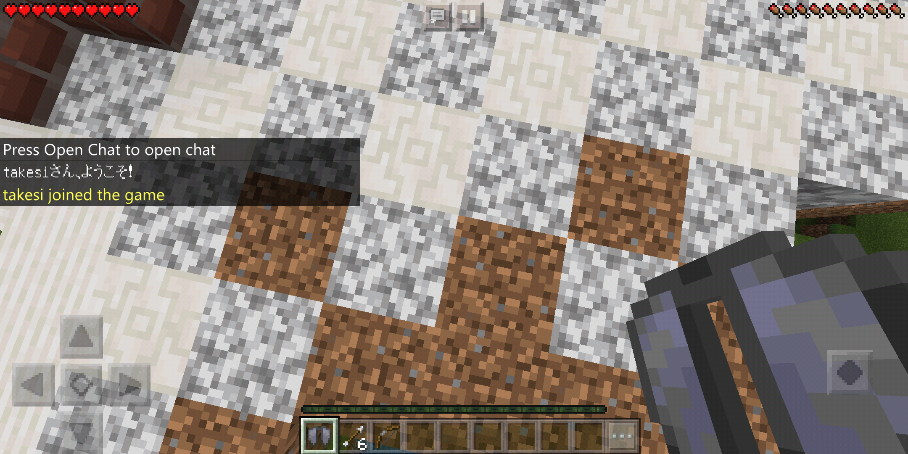

## 参加時にメッセージを送るプラグインが作りたい！

Main.phpにこれを張り付けましょう

```
<?php

declare(strict_types=1);

namespace tomo;

use pocketmine\plugin\PluginBase;
use pocketmine\event\Listener;
use pocketmine\event\player\PlayerJoinEvent;

class Main extends PluginBase implements Listener
{

    public function onEnable()
    {
        $this->getServer()->getPluginManager()->registerEvents($this,$this);
        $this->getLogger()->notice("Eventを登録しました");
    }

    public function onJoin(PlayerJoinEvent $event){
        $player = $event->getPlayer();
        $name = $player->getName();
        $player->sendMessage($name."さん、ようこそ！");
        if($player->isOp()){
            $player->sendMessage($name."さんはOp権限を所有しています。");
            foreach ($this->getServer()->getOnlinePlayers() as $p) {
                $p->sendMessage("OP権限を所有する".$name."がサーバーに参加されました");
            }
        }
    }

    public function onDisable()
    {
        $this->getLogger()->notice("Test plugin was unloaded!");
    }
}
```



これで参加時にメッセージを出すことができます。

`$this->getServer()->getPluginManager()->registerEvents($this,$this);`はイベントを登録します。

すると参加時に`public function onJoin(PlayerJoinEvent $event){`が呼ばれます。 (use文を忘れずに)

use文というのはこれを使いますよと宣言するためにあります。

`public function onJoin(PlayerJoinEvent $event){`ですが関数名はonJoinじゃなくてもaとかでも構いません。

ただし、PlayerJoinEventは変えないように

どんなイベントがあるかは[イベント一覧](https://github.com/pmmp/PocketMine-MP/tree/stable/src/pocketmine/event)を見てください。

結局この章だけあればプラグインかけたじゃないかと思うかもしれませんが、それは違います。

変数や関数、四則計算、条件分岐があるからこそ、上のコードを見ても理解できるのです。

例えば、パーティクルを出すコードを教えてもらってもどこに値を入れればいいのかわからないとせっかく教えてもらっても意味がありません。

コピーペーストだけして、できた気になっているようでは本当の実力がつきませんし、本当の実力があるものを超えることができません。

あと英語と数学、ググる能力をつけましょう。

英語はそもそも関数名が英語だし、コメントも英語。

数学は投げたアイテムの軌道計算やプレイヤーの方向計算に使います。

ググれないと人に聞いてばっかしになります。